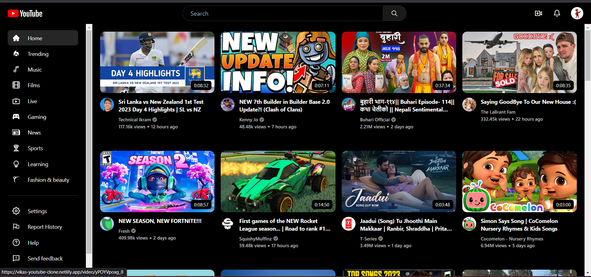
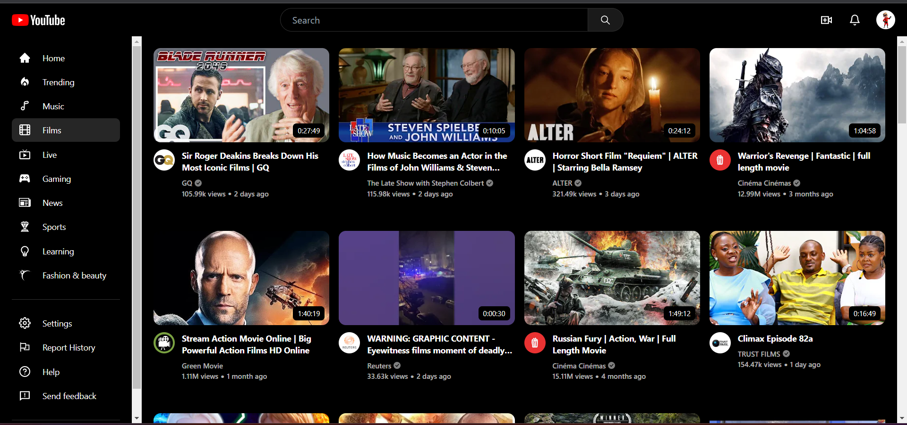
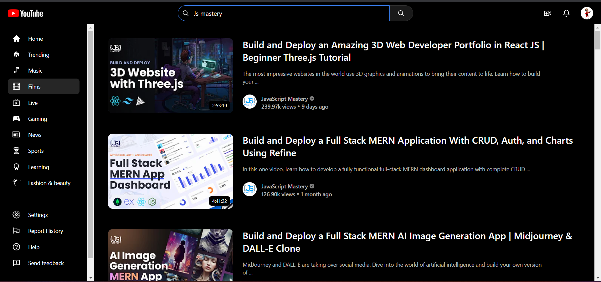
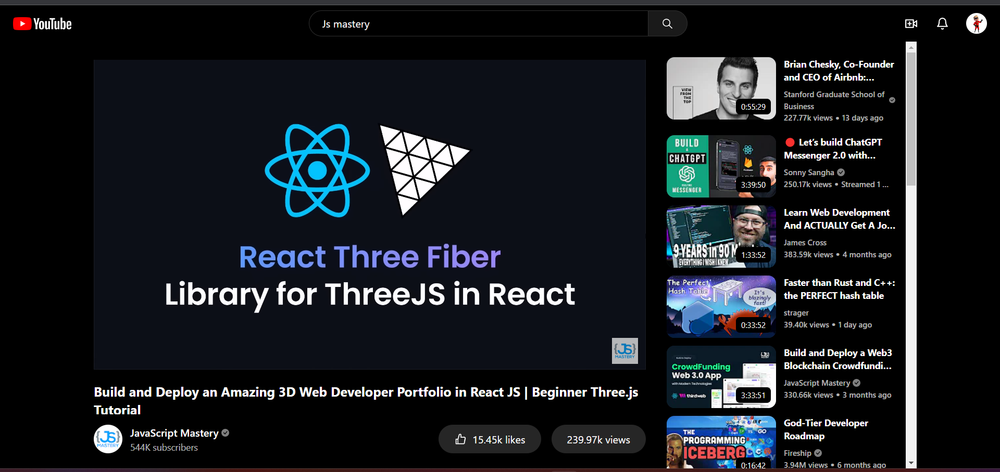
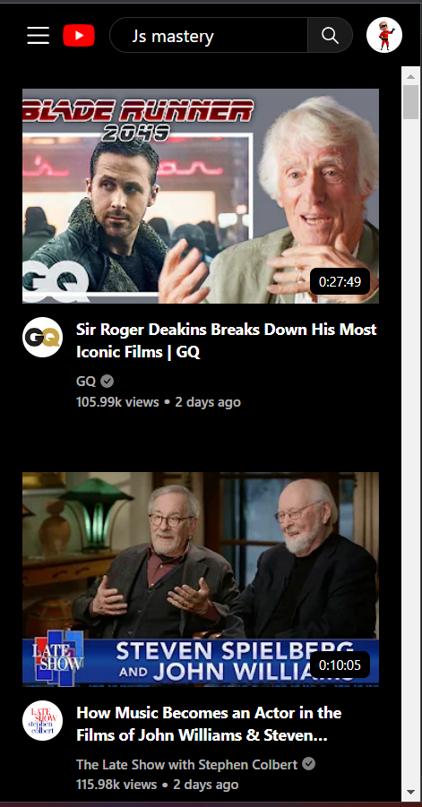
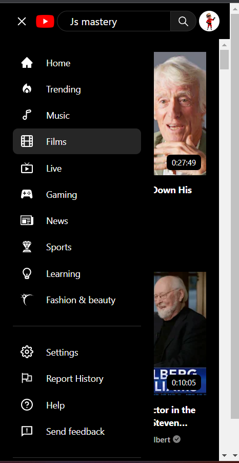
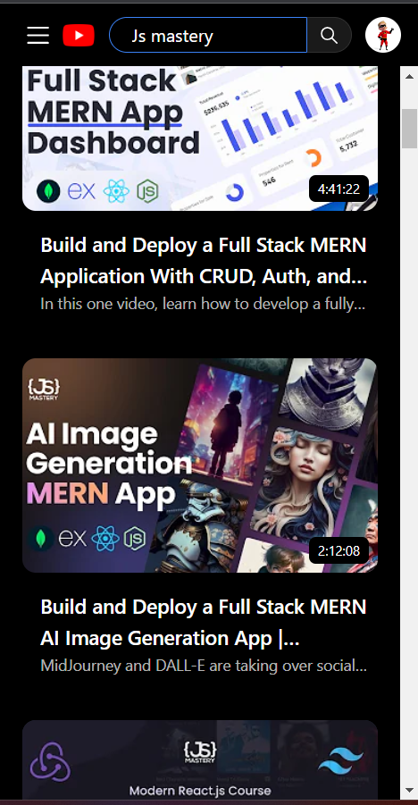
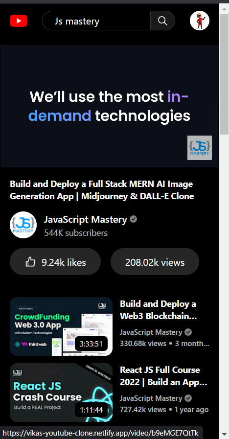

# React JS - YouTube Clone 

## Tech Stack Used
- React JS (JSX, Components, Props, State, list, Context Api etc...)
- Tailwind CSS - [Link](https://tailwindcss.com/)
- Rapid API - [YouTube](https://rapidapi.com/Glavier/api/youtube138/)

## Features
- Naviagte to different categories from Menu
- Search whatever you want from search Pnel
- Play any video and get suggestion for more similar videos
- Can see the Views and Likes of any video  
- Fully responsive for all Devices

## Links
### - [Source Code](https://github.com/Vikas350/YouTube-Clone)
### - [Live Link](https://vikas-youtube-clone.netlify.app/)

## Highlights
### Desktop homepage

### Navigate through Menu

### Search Results

### Play Video
- Show Details and Suggested similar Videos

### Fully Responsive
  _____  
----------------------------------------------------------
  _____  

## Credits
### Created By - Vikas Kushwaha
- Connect with me - [Linkedin](https://linkedin.com/in/vikas-kushwaha-165b95204)

